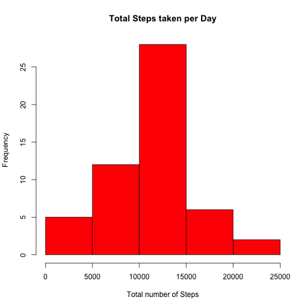
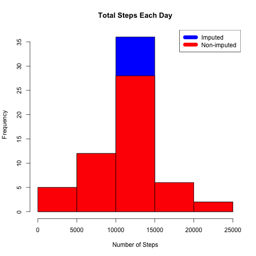
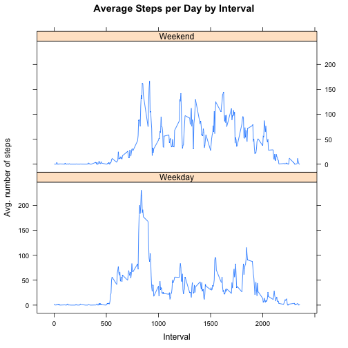

##### Coursera - Data Science Specialization Course
##### Reproducible Research -> Week 2 -> Peer Assessment 1
##### Date: 18 Jan 2015
##### Author: Ashish Rane

####Loading and preprocessing the data

Check if the file exists. If not then download the file, unzip and load the data into dataframe


```r
if(!file.exists("repdata-data-activity.zip")) {
        temp <- tempfile()
        download.file("http://d396qusza40orc.cloudfront.net/repdata%2Fdata%2Factivity.zip",temp)
        unzip(temp)
        unlink(temp)
}
data <- read.csv("activity.csv")
```

####What is mean total number of steps taken per day?

Calculate steps taken by day, create histogram and calculate mean & median 


```r
steps_taken_by_day <- aggregate(steps ~ date, data, sum)
hist(steps_taken_by_day$steps, main = paste("Total Steps taken per Day"), col="red", xlab="Total number of Steps")
```

 


```r
rmean <- mean(steps_taken_by_day$steps)
rmedian <- median(steps_taken_by_day$steps)
rmean
```

```
## [1] 10766.19
```

```r
rmedian
```

```
## [1] 10765
```
Mean -> 10766.19
Median -> 10765

####What is the average daily activity pattern?


```r
steps_taken_by_interval <- aggregate(steps ~ interval, data, mean)
plot(steps_taken_by_interval$interval,steps_taken_by_interval$steps, type="l", xlab="5-min Interval", ylab="Average number of Steps taken ",main="Avg number of Steps per Day by Interval")
```

 


```r
max_steps <- steps_taken_by_interval[which.max(steps_taken_by_interval$steps),1]
max_steps
```

```
## [1] 835
```
The 5-minute interval, on average across all the days in the data set, containing the maximum number of steps is 835.

####Imputing missing values

Total number of missing values in the dataset (i.e. the total number of rows with NAs)


```r
total_missing_values <- sum(!complete.cases(data))
total_missing_values
```

```
## [1] 2304
```

Total number of missing values in the dataset is 2304

####Strategy for filling in all of the missing values in the dataset


```r
new_imputed_data <- transform(data, steps = ifelse(is.na(data$steps), steps_taken_by_interval$steps[match(data$interval, steps_taken_by_interval$interval)], data$steps))
```

####Recalculate Total Steps and create histogram


```r
steps_by_day_i <- aggregate(steps ~ date, new_imputed_data, sum)
hist(steps_by_day_i$steps, main = paste("Total Steps Each Day"), col="blue", xlab="Number of Steps")

#Create Histogram to show difference. 
hist(steps_taken_by_day$steps, main = paste("Total Steps Each Day"), col="red", xlab="Number of Steps", add=T)
legend("topright", c("Imputed", "Non-imputed"), col=c("blue", "red"), lwd=10)
```

 

```r
#Calculate new mean and median for imputed data
```

```r
rmean.i <- mean(steps_by_day_i$steps)
rmedian.i <- median(steps_by_day_i$steps)
rmean.i
```

```
## [1] 10766.19
```

```r
rmedian.i
```

```
## [1] 10766.19
```

####Calculate total difference


```r
total_diff <- sum(steps_by_day_i$steps) - sum(steps_taken_by_day$steps)
total_diff
```

```
## [1] 86129.51
```

* The difference between the non-imputed median and imputed median is -1.188679
* The difference between total number of steps between imputed and non-imputed data is 7.5363 ?? 104. Thus, there were 86129.51 more steps in the imputed data.

####Are there differences in activity patterns between weekdays and weekends?


```r
weekdays <- c("Monday", "Tuesday", "Wednesday", "Thursday", 
              "Friday")
new_imputed_data$dayofweek = as.factor(ifelse(is.element(weekdays(as.Date(new_imputed_data$date)),weekdays), "Weekday", "Weekend"))

steps_by_interval_i <- aggregate(steps ~ interval + dayofweek, new_imputed_data, mean)

library(lattice)

xyplot(steps_by_interval_i$steps ~ steps_by_interval_i$interval|steps_by_interval_i$dayofweek, main="Average Steps per Day by Interval",xlab="Interval", ylab="Avg. number of steps",type="l",layout=c(1,2))
```

 

